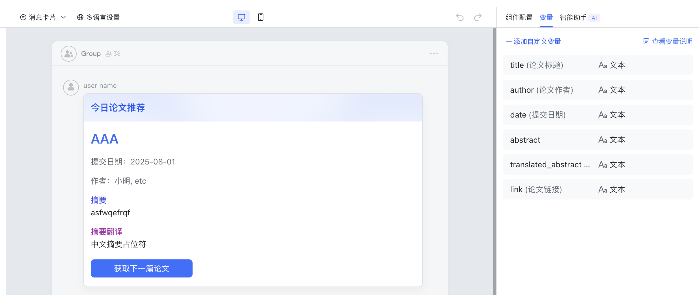

# Feishu Daily Arxiv Bot

Related Document: https://open.feishu.cn/document/uAjLw4CM/uMzNwEjLzcDMx4yM3ATM/develop-an-echo-bot/introduction

The latest papers from Arxiv will be pushed to the group chat at 12:00 PM every day. The current logic will exclude all interdisciplinary papers, retaining only those in the pure computer science field.

## Quick Start

1. Create a Python environment: `uv venv && source .venv/bin/activate`

2. `uv pip install -r requirements.txt`

3. In the [Related Documents] link, click to copy the startup instructions, create a .env file, and set the following three environment variables:
- BASE_DOMAIN=https://open.larkoffice.com
- APP_ID=
- APP_SECRET=

4. `python python/main.py`

## Available Commands

If you are an administrator, you can add your own open_id to Arxivbot's `self.open_id`, or you can create a command that mimics existing commands to add others' open_ids.

/config: Configures the required_keywords and optional_keywords for the current group chat. Example usage: /config optional:A or B, C or D or E required:keyword1,keyword2. This sets the query to (A or B) and (C or D or E) and keyword1 and keyword2.

/daily_arxiv: Proactively instructs the bot to publish papers that meet the requirements on the same day. You can set a time. See /help for details.

## Module Introduction

### arxiv_crawler

Based on the code from https://github.com/huiyeruzhou/arxiv_crawler, the interface has been modified to abandon strict time manipulation in favor of more diverse constraints.

- The arxiv advance search web interface only processes conditions from the beginning to the end and cannot handle queries like (A or B and (C or D). If you want a more precise time query, you can modify this.

- Query Logic: First, check if there are any papers meeting the requirements in the database. If not, a search is performed. If no papers meet the requirements today, the search is performed within the past three days. If no papers meet the requirements, an empty string is returned.

- Currently, the query logic is primarily contained in the fetch_all_api function.

### Sending and Receiving Messages

#### chat_id and open_id

When actively sending a message to a user, use the open_id function to call the API.

When replying to a user or group message, use the chat_id function.

To actively send a message to a group chat, first execute update_group_ids to retrieve the list of currently joined group chats.

#### Sending a Card

You can view the card interaction API on the Feishu Open Platform. My card ID is AAqzQKpE1cGWO.

Note that the button callback event parameter is action: next_article