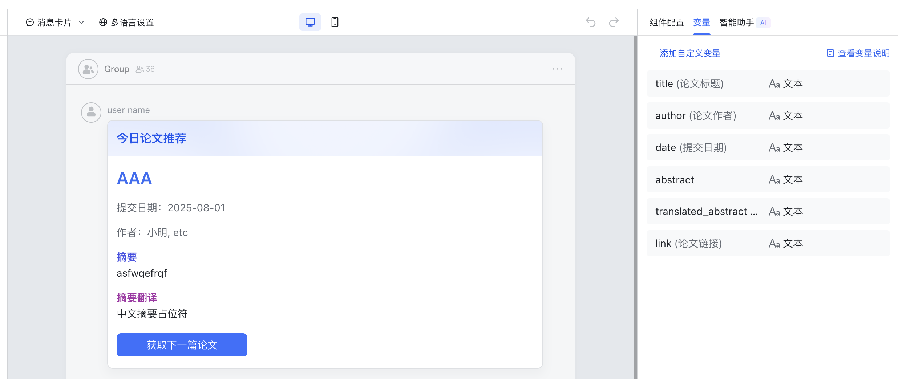

# 飞书每日arxiv机器人

相关文档：https://open.feishu.cn/document/uAjLw4CM/uMzNwEjLzcDMx4yM3ATM/develop-an-echo-bot/introduction

每日12点会向群聊推送arxiv上的最新论文。目前逻辑会筛除所有交叉学科的论文，只保留纯计算机领域

## quick start

1. 创建python环境， uv venv && source .venv/bin/activate

2. uv pip install -r requirements.txt

3. 在[相关文档]链接中，点击复制启动指令，创建.env文件，设置以下三个环境变量：
- BASE_DOMAIN=https://open.larkoffice.com 
- APP_ID=
- APP_SECRET=

4. python python/main.py

## 可用命令

如果你是管理员，可以把自己的open_id加到Arxivbot的self.open_id中，也可以仿照已有命令写一个可以添加别人open_id的指令。

/config: 配置当前群聊的required_keywords和optional_keywords, 用法示例：/config optional:A or B, C or D or E required:keyword1,keyword2， 这将设置查询条件为 (A or B) and (C or D or E) and keyword1 and keyword2

/daily_arxiv: 主动让bot发当天满足限制条件的论文，可以设置时间，具体/help查看

## 模块介绍

### arxiv_crawler

参考了 https://github.com/huiyeruzhou/arxiv_crawler 的代码，但是修改了接口，放弃了严谨的时间操作，转而追求限定条件的多样化

- arxiv advance search网页接口，只能从前到后处理条件，无法处理 (A or B) and (C or D) 这种条件查询， 如果想精确查询时间，可以修改

- 查询逻辑：首先看数据库内有没有满足条件的论文，没有则进行搜索；如果当天没有满足要求的论文，会查找三天内满足要求的论文，如果仍然没有，返回空

- 目前查询逻辑主要存在于fetch_all_api一个函数

### 发送和接收消息

#### chat_id和open_id

向用户主动发送消息时，使用 open_id 调用接口；

回复用户消息/群消息时，使用 chat_id

向群聊主动发送消息：先执行 update_group_ids 获取当前加入的群聊列表

#### 发送卡片

可以在飞书开放平台上查看卡片交互相关api, 我的卡片id是AAqzQKpE1cGWO

注意，按钮的回调事件参数是action: next_article

